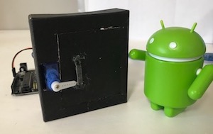

# Face Recognition Door Lock
## Set up
1. Run initdb.py to create sqlite database
2. Connect your Arduino UNO (connect servo to D9)
3. Substitute your device's serial port into main.py (inside serial.Serial())
4. Run main.py
    1. Use 'Picture' to take picture of your face
    2. Enter your name and press 'Add'

## Usage
Press 'Unlock'/'Lock' to unlock/lock door (by changing servo position).

## References
[Opencv Face Recognition](https://github.com/Aryal007/opencv_face_recognition)
